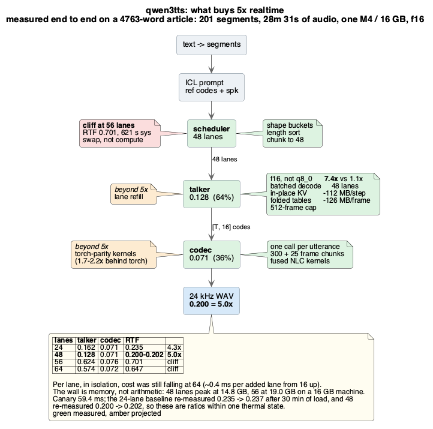
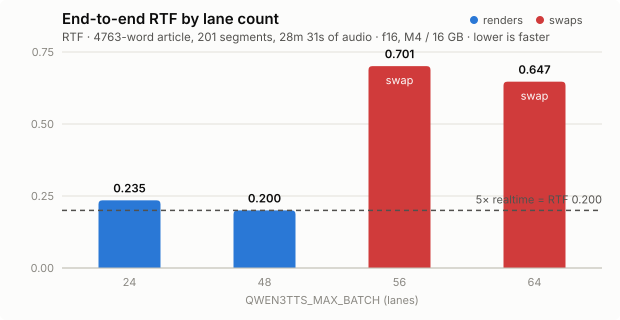
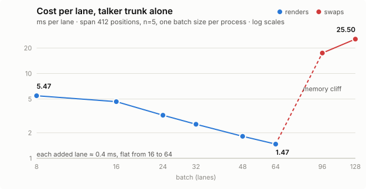

# dream-tts

Narrate anything in a cloned voice, on your own Mac, offline. A 1612-word chapter becomes
11 minutes of speech in 1m 44s. One binary, no service, no API key.

### ▶ [Hear it first: one chapter, three engines, two cloned voices](https://drmhse.github.io/dream-tts/)

**Requirements: macOS 13 or newer on Apple silicon, and `curl`.** The custom kernels are
Metal. Every number here was measured on an M4 with 16 GB. It builds and runs elsewhere with
`--no-default-features`, on unit-tested CPU fallbacks. That path is a portability guarantee,
not a deployment target. `audio8` measures RTF 2.151 on CPU against 0.554 on Metal. Its
codec suffers most: 1.235 against 0.214.

## Speak your first sentence

```sh
curl -fsSL https://raw.githubusercontent.com/drmhse/dream-tts/main/install.sh | sh
cd dream-tts && ./scripts/bootstrap.sh       # the model. ~4.3 GB, resumable, verified

./dream-tts speak --text "Hello from a fresh install." --out hello.wav
```

**`curl` is the only prerequisite.** No Rust toolchain, no Python. That holds because the
default engine, `qwen3tts`, has no conversion step — its checkpoint is a plain download —
and because a `v*` tag publishes prebuilt arm64 binaries. It is also the best quality of the
three and more than three times as fast on book-length text, so the cheapest path is also
the one you want. The [demo](https://drmhse.github.io/dream-tts/) is there so you can
disagree before you download anything.

From a git clone instead, with a toolchain, it is one command:

```sh
./scripts/bootstrap.sh              # checkpoint, assets, build. ~4.3 GB
```

`bootstrap.sh` downloads the checkpoint, fetches the fixtures for its gates, and either
builds or downloads the binaries — it builds when there is a toolchain and sources, and
downloads otherwise. Nothing is manual. Add the other engines whenever you want them:

```sh
./scripts/bootstrap.sh --list              # the ids, their models, what each costs
./scripts/bootstrap.sh audio8 cosyvoice    # 44.1 kHz output, and the widest language coverage
./scripts/bootstrap.sh --all               # all three, ~13 GB
```

Those two are where Python appears: both convert their checkpoints with PyTorch, so they
want python >= 3.10 and a torch venv. Asking for them is what buys that cost, and it is
never paid by someone who did not. Every step is skipped if its output exists, so re-running
is cheap. Details in **[docs/reference.md](docs/reference.md#setup)**.

`./dream-tts` and `./dream-tts-serve` run the built binary when there is one and the
downloaded binary when there is not; [scripts/run-bin.sh](scripts/run-bin.sh) says how it
chooses. Both resolve their own symlinks, so `ln -s "$PWD/dream-tts" ~/.local/bin/` is all
it takes to run `dream-tts` from anywhere — asset paths stay pinned to the install, while
`--out` and `--text-file` stay relative to wherever you typed them.

## Speak in someone's voice

A voice is a directory, and the repo ships several. Building your own takes a clip of about
ten seconds and its exact transcript:

```sh
references/qwen3tts/.venv/bin/python references/qwen3tts/export_voice.py \
    --model references/qwen3tts/weights --audio clip.wav \
    --text "the exact words spoken in the clip" \
    --name my-voice --out voices/my-voice
```

Pass it to any command as `--voice voices/my-voice`. `./dream-tts voice voices/my-voice` prints
what an asset holds without synthesising.

This export is the only step that wants Python, and it runs once per voice. Install
`references/<engine>/requirements.txt` in a venv first. The speaker encoders stay there: the
runtime loads the exported conditioning and never carries an encoder.

## The engines, and what they cost

All three narrate the same 1612-word chapter (`examples/chapter.txt`, in the repo). Each runs
in the configuration it ships in, in two cloned voices, on one M4 with 16 GB and no Python
running. GitHub cannot embed audio in markdown, so the
[demo page](https://drmhse.github.io/dream-tts/) plays all six in place.

| engine | RTF | wall time | audio produced | reach for it when |
|---|---|---|---|---|
| `audio8` | 0.527-0.536 | 5m 47s | 11:34 / 10:59 | you want 44.1 kHz, the highest-fidelity output here |
| `cosyvoice` | 0.703-0.718 | 8m 15s | 12:48 / 11:44 | you want the widest language coverage |
| `qwen3tts` | **0.148** | **1m 44s** | 11:44 / 10:34 | the default. Best quality here, and the only one that makes book-length text practical |

**That bottom row is the point of the project.** A chapter becomes 11 minutes of speech in
1m 44s, on a laptop — 6.8× faster than realtime. A 16-hour book costs about 2.4 hours of
compute rather than 11.5.

Compare the wall-time column, not just RTF. The three do not produce the same duration from
the same text. `cosyvoice` speaks slowest, 12:48 against `audio8`'s 11:34. RTF divides by audio
produced, so a slower-speaking engine flatters its own RTF.

```sh
./dream-tts speak --text-file examples/chapter.txt --out chapter.wav
```

No flags: `qwen3tts` at f16 and 48 lanes is what you get by asking for nothing. It gets there
by batching across sections, so it wants length — on a 7-segment passage it is 0.397, against
0.148 on the chapter. The other two do not batch meaningfully and are steady at any length.
`audio8` is **2.36× its PyTorch reference** like for like, with that reference running on MPS
too.

Short-passage figures, for comparison. `examples/senior.txt`, 132 words: `audio8` 0.544,
`cosyvoice` 0.716, `qwen3tts` 0.397.

### What it needs to be this fast

**16 GB.** `qwen3tts` peaks at 12.3 GB on a single short passage and 13.0 GB on a 203-segment
article, and almost all of that is the codec decoder's activations rather than weights — one
300-frame chunk alone is 5.5 GB. Below 16 GB the engine says so on load and keeps going, which
is the honest option: it will swap, and swapping presents as the model being slow rather than
as a mistake.

**`--quant q8_0` is not the fix for a smaller machine**, though it looks like one. It halves the
weight read, which matters only where nothing batches, and it does not touch the floor: on that
132-word passage it peaks at 11.72 GB against f16's 12.30 — 0.58 GB — while running at 62% of
f16's speed (RTF 0.642 against 0.397). On a chapter the gap is 4.5×. Reach for it to fit a single
short render into a machine that misses by half a gigabyte, and for nothing else.

What does help a smaller machine is a different engine. Same passage, same measurement:

| engine | peak footprint | RTF |
|---|---|---|
| `cosyvoice` | **5.0 GB** | 0.716 |
| `audio8` | 9.7 GB | 0.544 |
| `qwen3tts` | 12.3 GB | 0.397 |

`QWEN3TTS_MAX_BATCH` trades lanes for footprint if you want to stay on this engine, but it
cannot go under the codec's own ~12 GB.

## What makes `qwen3tts` fast, and where the 6.9× comes from



Every green component above is measured; together they take this engine to **RTF 0.144-0.148 —
6.8× to 6.9× realtime** on its default settings, across corpora between 1612 and 4838 words.
Four of them carry most of it, and two are kernels:

- **f16 weights, and they are the default.** Only a dense GEMM shares one weight read across
  lanes; candle's quantized `mm_t` re-reads per row, so q8_0 amortises 1.1× against f16's 7.4×.
- **The codec's convolutions gather their taps inside the GEMM.** Both conv-as-GEMM routes were
  losing to *assembling* the operand rather than multiplying it — 85.8 ms to build the im2col
  against 8.2 ms for the GEMM consuming it — so the tap index moved into the kernel, where the
  tile is already in threadgroup memory. 1.70× on a codec chunk, and bit-identical output. The
  transposed convs are the same conv with their tap groups reversed, which is one GEMM instead
  of `m` plus a shifted copy each: 172.0 ms to 80.3.
- **A GEMM shaped like a decode step.** `m` is the lane count, and candle reaches 3.64 TFLOP/s
  on a 2048-cube but 1.07–2.34 at m = 48. A 48×64 tile — the batch, not a slice of it — beats
  it on all seven of the talker's projections, 1.08× to 1.46×. Rounding the batch up into a
  64-row tile instead gives a quarter of the matrix-unit work to padding and *loses*.
- **48 batched lanes, sorted longest-first, shedding each finished tail.** A group runs as long
  as its longest lane, so ordering decides how much of the batch is real work: 68-70% of
  lane-steps were useful before, 79-90% now. Only a contiguous *tail* can be dropped — a prefix
  narrow shares the caches' storage — which is why the sort order is what makes it work.

| corpus | segments | was (24 lanes) | 48 lanes | shipped | |
|---|---|---|---|---|---|
| Pixel Watch article, 4838 words | 203 | | 0.193 | **0.144** | **6.9×** |
| `examples/chapter.txt`, 1612 words | 100 | 0.260 | 0.186 | **0.148** | **6.8×** |

**Shedding pays most where segment lengths vary most**, so these are a floor rather than a best
case: the article's segment lengths have the narrower spread of the two and it gains the least.

**Quality is checked on the audio, not on the codes**, because token identity is the wrong metric
for a sampled model — two of the four changes above move the logits, and a sampled model then
takes a different path through the same text. Against the article, WER is **0.036** where the
release before it was 0.038 (176 against 184 errors in 4838 words), and median F0 and LTAS cosine
against the clip this voice was cloned from are **175.8 Hz and 0.9974**, unchanged to the digits
that mean anything. `references/cosyvoice/wer.py` and `references/audio8/verify_voice.py` are the
tools. The fused conv is stronger than that: its render is bit-identical to the one before it
across all 42,454,560 samples.

### Memory is candle's buffer pool, not the lane count

Peak footprint is now **12.5-13.0 GB**, from 14.2-14.8. The lever is not obvious, so it is worth
stating plainly: `vmmap` attributes a render to GPU allocations far exceeding its ~4.5 GB of
weights, because candle's Metal pool keys buffers by size and releases none. Every distinct
tensor shape a run touches is therefore permanent, and most memory wins here are a *shape
removed* rather than bytes shaved:

- **The codec decodes a uniform span, padded on the right.** The natural loop runs two lengths —
  300 frames for the first chunk, which has no history to spend, then 325 — and one 300-frame
  chunk is **5.55 GB** of activations, so the second length cost about that again. Extending each
  window *rightwards* is free because the decoder is causal, and the gate confirms the audio is
  unchanged. Moving the seams instead is *not* free: `codec.long.wav_chunked` fails at rel 3.4e-1,
  because the reference's own chunked output differs from its unchunked one.
- **Weights are mmapped and fetched per tensor.** `safetensors::load` was uploading the whole
  3.86 GB checkpoint to the GPU beside the f16 copies. A one-sentence render's floor went 9.24 →
  8.09 GB and a chapter's RSS 7.79 → 4.32 GB, at no cost in throughput.
- **Prefill runs in 8-lane windows and shed widths are multiples of 8.** Prefill attention is
  `b × heads × L²` — 748 MB of scores at 48 lanes — and narrowing 48 → 47 → 46 minted a new width,
  hence new buffer sizes, every step.

A lane itself is cheap: **13 MB** of peak footprint between 24 and 48 lanes, against the 77 MB its
KV cache implies. So the 16 GB machine runs out because of the floor, not the lanes.



**Past 48 lanes it swaps, and that is not one allocation anyone can move.** The obvious
suspect is that a 100-segment document splits 64 + 36, so the KV cache is allocated at two
widths and the pool keeps both. It is not enough: four separate attempts at freeing 64 lanes
are recorded in [what did not work](docs/reference.md#what-did-not-work), and the closest —
slicing the codec's waveform stack, which is *exact*, since every conv below the pre-transformer
is causal — bought 1.08 GB for 9% more time and still swapped at 64. Peak goes 12.7 to 15.8 GB
between 48 lanes and 64, and it is spread across the run rather than sitting in one buffer. The
codec's activations are the floor, and the only lever on those costs more than the lanes return.

There is no arithmetic saturation to find before that wall. An added lane costs about 0.4 ms
from 16 to 64, and per-lane cost is still falling where the engine has already run out of
memory — 1.615 ms at 48 against 1.460 at 64, because 64 fills the 8×8 matrix tiles that 48
leaves ragged. Only past that does the curve turn: 96 lanes costs 17.4 ms per lane and 128
costs 31.3, which is the VM compressor rather than arithmetic.



A machine with more memory should sweep `QWEN3TTS_MAX_BATCH` again — the cliff moves, and the
curve above it has not flattened. Regenerate both charts with `python3 scripts/plot-lanes.py`;
the measurements are inline in that script.

The two amber components are what a *seventh* multiple would need, and neither has a fixture
behind it: refilling an interior lane the moment it hits `codec_eos` rather than only shedding
tails, and closing what the codec still gives away to torch. The codec is 26% of the total now,
down from 40%, and does not batch by construction — with a free talker the floor is RTF 0.038,
or 26×, so the ceiling has moved back to the talker.

What each component is doing, and the paths already refuted — f32 weights, batched q8_0,
device-side sampling, an f16 codec, ONNX, CoreML — are in
[docs/reference.md](docs/reference.md#performance).

Regenerate the diagram after any change to those numbers:

```sh
plantuml -tpng docs/qwen3tts-speedup.puml
```

## Narrate a whole book, from any document

```sh
dream-tts book book.epub --out narration      # kick off, watch, Ctrl-C is safe
dream-tts jobs                                 # what is running, anywhere on this machine
dream-tts jobs <id> --control pause --now      # stop within seconds
dream-tts book book.epub --out narration      # the same command resumes it
```

A thousand-page reference book is hours of synthesis, and that length changes what the
software has to be. Three things follow, and they are why there is a client and a server:

- **It has to survive interruption.** So the state cannot live only in the process doing the
  work. `dream-tts book` submits to `dream-tts-serve`, which owns the engine and the queue,
  and starts one if none is running.
- **A run has to be discoverable by a process that did not start it.** Otherwise the second
  thing anyone does is start a second run on top of the first. Job records are files under
  `data_dir/jobs/`, so `dream-tts jobs` answers with no server up — which is exactly the
  moment someone is about to start another one. It also reports what the machine can hold:
  *"1 run in flight; this machine (16 GB) has room for about 3."*
- **Progress has to be worth watching.** The engines report per-segment, and that goes
  straight out as server-sent events, so the bar moves several times a second rather than
  once a chapter.

**The estimate is fitted, not averaged.** These engines have strong economies of scale —
`qwen3tts` batches across segments, which only engages once a chapter has enough of them, so
the same voice runs at RTF 0.397 on a 132-word passage and 0.148 on a 1612-word chapter. A
flat words-per-second rate is therefore wrong by 2.7×, in whichever direction the sample
happens to lean: on a real book, extrapolating from its 27-word title page predicted **2h
09m against an actual hour**. So the model is `fixed + marginal × words`, fitted over the
chapters that have finished and applied to each remaining chapter individually — a long one
amortises the fixed cost the way it really does. And there is *no* estimate until two
chapters are done, because a confident wrong number errs in the direction that makes someone
abandon a run that would have finished.

**Resume is the same command.** A job's id is a hash of the text that will be spoken and the
settings it will be spoken with, so re-running finds the run already in progress and adopts
its finished chapters — no flag, no remembered id. Editing a chapter changes the hash, which
is deliberate: resuming onto audio of the old wording would be silent damage.

**Pause has two costs, and says which.** `--control pause` stops after the chapter in
flight and keeps its work. `--control pause --now` interrupts between segments and stops
within seconds, discarding that chapter so it is narrated again on resume. On a reference
book whose chapters run twenty minutes, a pause that only lands on boundaries is not a
pause — so both exist and each states its trade.

Everything is observable from anything: `GET /v1/jobs` for a list, `/v1/jobs/<id>/events`
for the stream, and the service's own page shows every run live. Your own status bar or
script is as much a client as the CLI is.

## Delivery audio: WebM and alignment

```sh
scripts/narrate-book.sh --document book.epub --out narration
scripts/verify-narration.py narration/*.webm
```

`dream-tts book` above gives you WAV masters, a resumable job and live progress. This script
is the layer past that: delivery encodes and word-level alignment manifests, which is what a
published audiobook needs and a WAV is not.

**It is the one part that needs something dream-tts does not ship: `ffmpeg`.** It says so
before it starts rather than an hour in, and `--no-align` drops the only other outside
dependency. The `dream-tts` commands themselves need nothing but the binary.

Resumable per *stage*: a section with a WAV master is never re-synthesised. Deterministic
under a seed. A 16-hour document costs about **2.4 hours** of synthesis at `qwen3tts`'s 0.148,
against ~11.5 at `cosyvoice`'s 0.716. Recognition adds an hour either way.

**Import is a stage in front, not a branch inside.** The pipeline takes its chapter
structure from the filesystem — `chapter-NNN.md`, one per file — so `dream-tts import` turns
a document into those files and nothing downstream changes:

```sh
dream-tts import book.epub --out prep/ --dry-run   # see the split before committing hours
dream-tts import book.epub --out prep/
```

Which means the work is not extracting text; it is **splitting one document into chapters**,
and that is what decides which formats are easy:

| format | where the chapters come from |
|---|---|
| EPUB | the OPF spine *is* the chapter list, in reading order |
| DOCX / ODT | `w:pStyle` / `text:outline-level`, stated by the file |
| HTML, Markdown | the heading levels |
| PDF | the outline it declares, else one chapter — a wrong split is worse than none |

**PDF goes through PDFKit.** Reading order, column detection and de-hyphenation are a large
body of work no pure-Rust extractor matches, and PDFKit lives in
`/System/Library/Frameworks`, so it costs nothing to install and keeps the release audit's
"system frameworks only" rule intact. A scanned document is refused with the fix named
rather than silently yielding nothing — this extracts text and does not do OCR.

`dream-tts speak --text-file` accepts the same formats and narrates them; a `.txt` file is
spoken literally, and `--raw` forces that for anything.

## Serve it over HTTP

```sh
DREAM_TTS_API_KEY=secret ./dream-tts-serve --port 3003

curl -X POST localhost:3003/tts -H "X-API-Key: secret" \
     -H 'content-type: application/json' \
     -d '{"text":"Hello from Rust.","voice":"voices/cosy-default-male","seed":7}' \
     -o out.wav -D headers.txt
```

One engine, loaded once, in 3.0 s. `voice` and `seed` are per request. The first selects a
voice asset without a restart. The second makes a render reproducible. `--engine` and
`--voice` default to whatever the registry says, so the service and `dream-tts engines`
cannot drift apart.

**`POST /tts/stream` is incremental.** Raw PCM as each segment lands, chunked, so first
audio arrives after one segment rather than after the whole render — measured at **2.7s to
first audio against 5.5s buffered** on the same text. Even unbatched `qwen3tts` stays well
under realtime — 0.397 on the short-passage fixture — so the stream outpaces playback and a
listener never runs dry after that first segment. It is *slower overall* on purpose: one
segment at a time gives up the cross-segment batching worth 2.7× on book-length text, which
is the right trade for a live listener and the wrong one for a book — so the job runner does
not use this path.

**Open it in a browser.** `GET /` answers JSON to a client and a self-contained HTML page
to a browser, chosen by `Accept` — the routes, the request body, the response headers, the
auth rule, and this process's live engine, voice and settings file. No CDN and no asset
routes: a local service that needs the network to explain itself is broken in exactly the
situation someone is most likely to be reading it. `?format=json` and `?format=html`
override the negotiation.

| route | |
|---|---|
| `POST /tts` | WAV body, PCM s16le mono. JSON, or `text/plain` with the text as the body |
| `POST /tts/stream` | same, incremental rather than buffered: raw PCM as each segment lands |
| `GET /v1/capabilities` | engines, sample rates, languages, and the weight formats each supports |
| `GET /v1/jobs` | narration runs. `POST` submits one; the same document resubmitted resumes it |
| `GET /v1/jobs/<id>/events` | server-sent events: per-segment progress and every state change |
| `POST /v1/jobs/<id>/<action>` | `pause`, `pause-now`, `resume`, `cancel`, `cancel-now` |
| `GET /health` | liveness |
| `GET /` | routes, live and unimplemented. JSON to a client, **an HTML page to a browser** |

**Every response carries its own cost.** `x-audio-seconds`, `x-wall-seconds`, `x-rtf`, and
`x-stages` with the per-stage split (`llm=10.296,flow=25.129,vocoder=2.898`). A client sees
where the time went without a second request.

## Use it as a library

```rust
use std::sync::Arc;
use tts_core::{EngineConfig, SynthesisRequest, Voice};

let id = tts_engines::default_id();                   // "qwen3tts"
let config = EngineConfig::new(tts_engines::default_root(id));
let engine = tts_engines::load(id, &config)?;

let voice = Voice::load(tts_engines::default_voice(id))?;
let request = SynthesisRequest::new("Hello from Rust.")
    .with_voice(voice)
    .with_progress(Arc::new(|e| eprintln!("{e:?}")));   // segments done, per stage
engine.validate(&request)?;                 // rejects a mismatched asset up front

let out = engine.synthesize(&request)?;
tts_core::wav::write("hello.wav", &out.audio)?;
println!("RTF {:.3}", out.stats.rtf(out.audio.seconds()));
```

One `Engine` trait. Engines are chosen by string id at request time. `default_id()` returns
the first *available* entry in the catalogue, and `default_caveat()` returns the sentence a
caller that did not choose an engine needs to see — see the first limitation below.

## Living with it

```sh
./dream-tts config       # every setting, and which file or variable decided it
./dream-tts storage      # what is on disk, biggest first, and what removes each part
./dream-tts engines      # what is installed, what each supports, which is the default
./dream-tts import       # any document into chapter-NNN.md
./dream-tts narrate      # markdown into the text an engine should speak
./scripts/uninstall.sh   # reports; deletes nothing until you name a category
```

**Settings.** Copy [`dream-tts.example.json`](dream-tts.example.json) to `dream-tts.json`
and edit it — engine, voice, quant, gaps, the service's host and port, and `data_dir`.
Precedence is flag, then environment, then `dream-tts.json` beside the install, then
`~/.config/dream-tts/config.json`, then the built-in default. Keys beginning with `//` are
comments; every other unknown key is an error, because a misspelled key that silently does
nothing is the worst outcome available. `dream-tts config` prints what actually resolved,
which is the only thing that makes a precedence chain debuggable.

**Storage.** `data_dir` is the 4-13 GB — checkpoints and fixtures — and it is separate from
the install so it survives an upgrade and can sit on an external disk:

```json
{ "data_dir": "/Volumes/ssd/dream-tts" }
```

**Progress, and resuming.** `bootstrap.sh` knows the total byte count before the first byte
arrives, because it HEADs every file first. So the bar is bytes across the whole set, not a
per-file percentage — meaningless when file 7 of 11 is 4 GB and the rest are 2 KB. It
resumes where it stopped, counts what was already there as progress, and verifies each
large file against the sha256 the server reports. A file that fails is deleted rather than
left as a plausible-looking truncation.

**Not colliding with the rest of your machine.** Every name is prefixed: the binaries are
`dream-tts` and `dream-tts-serve`, the settings file is `dream-tts.json`, the variables are
`DREAM_TTS_*`, the user config is `~/.config/dream-tts/`. `tts` alone belongs to whoever
installed it first — coqui-TTS ships a binary by that name.

Two engines resident do not fit in 16 GB, and the machine swaps rather than failing, which
looks like the models getting slower instead of like a mistake. So synthesis takes an
advisory `flock` in `data_dir` and a second process is refused with a message naming the
first. Per weights, not per machine: two independent installs do not contend. `--no-gpu-lock`
opts out. The service keeps `PORT`/`3003` for wire compatibility with the Python service it
replaces, and answers a taken port by naming the `lsof` line that finds the holder.

**Uninstalling.** `scripts/uninstall.sh` with no arguments lists every category with its
size and deletes nothing. `--weights`, `--venvs`, `--fixtures`, `--build`, `--all`, or
`--everything` to also remove the directory. It refuses to touch anything outside the
install and the data directory, and refuses to run unattended without `--yes`.

## Limitations

- **Ten languages on `qwen3tts`**, a closed list: en, de, es, zh, ja, fr, ko, ru, it, pt. Text
  outside it has no faithful path through that engine, and since it is the default, a caller
  that omits `--engine` gets that limit without asking for it. So it is reported rather than
  hidden: `Capabilities::languages` carries the list, `GET /v1/capabilities` returns it, and
  both the CLI and the service print it when the engine was defaulted rather than named. Not
  a hard rejection — identifying a language from arbitrary text is a guess, and a guess that
  refused valid English would be worse than the warning. Use `--engine audio8` or
  `--engine cosyvoice` for anything outside the list.
- **A known performance regression, undiagnosed.** `audio8`'s codec and `cosyvoice`'s vocoder
  are 35% and 32% slower than when first measured, while every transformer stage is unchanged.
  Both are convolution-heavy. The cause is likely the channels-last conv path.
- **Sampled output is not reproducible across implementations.** The reference draws from
  torch's RNG. Pass a `seed` for repeatability within this port. Use the greedy path if you
  need to compare against PyTorch.

One comparison is not worth making. `cosyvoice` looks 6× faster than its PyTorch reference.
That is only because upstream hardcodes `cuda if available else cpu` and has no MPS path.
Against a service that does use MPS it is ahead by about 5%.

## How it is built

Three PyTorch models, ported to Rust and candle, with the Metal kernels written here. Each
stage is validated against fp32 activations dumped from its reference, so a mismatch names the
layer that caused it. `scripts/fetch-assets.sh` pulls ~130 MB of checksummed ground truth from
[`drmhse/tts-rs-assets`](https://huggingface.co/datasets/drmhse/tts-rs-assets), so
`./scripts/gates.sh` runs the gates without any PyTorch installed.

## Turning a document into speech

Markdown fed to a TTS engine reads its own syntax aloud, and some of what survives is
actively destructive: a `***` that reached the voice made one chapter say "asterisk,
asterisk, asterisk" and then degenerate into a repetition loop for the rest of the passage.
`crates/tts-narrate` is the layer that prevents it — inline code as a narrator would read
it, LaTeX spans verbalised, units and rates and currency and dates expanded, tables rewritten
as one sentence per row, semicolon clauses split, and about forty other rules, each one
arrived at by listening to a failure.

It is a port of `scripts/md-to-narration.py`, which stays in the tree as the long-form record
of *why* each rule exists and as the reference the port is checked against. A port of a
thousand regexes is only as good as the evidence that it agrees with the original, so:

```sh
./scripts/check-narrate.sh
```

runs both implementations over 6190 lines and 621 documents — every construct each rule
targets, the real chapter in `prep-handbook/`, and seeded random recombinations, because most
of the recorded traps are *interactions* between rules — and requires byte-identical output
from all seven functions, the word-alignment map included. `scripts/gates.sh` runs it as a
tier. The port found three real bugs in itself this way that no hand-written case had caught.

## Documentation

Everything else is one file: **[docs/reference.md](docs/reference.md)**. Agents get
[`AGENTS.md`](AGENTS.md) and the [`dream-tts` skill](.agents/skills/dream-tts/SKILL.md).

| | |
|---|---|
| [Setup](docs/reference.md#setup) | install or clone to working audio, in three levels |
| [Architecture](docs/reference.md#architecture) | the engine trait, voice assets, adding an engine |
| [Validation](docs/reference.md#validation) | what each gate proves, and what is deliberately not gated |
| [Performance](docs/reference.md#performance) | the numbers, the measurement protocol, and two open regressions |
| [Porting traps](docs/reference.md#porting-traps) | eight Audio8 and nine CosyVoice traps, each of which produced plausible but wrong output |
| [Serving and narration](docs/reference.md#serving-and-narration) | the HTTP service, its browser page, and markdown to audiobook |
| [Settings and storage](docs/reference.md#settings-and-storage) | `dream-tts.json`, `data_dir`, the GPU lock, uninstalling |
| [Documents and narration](docs/reference.md#documents-and-narration) | the import stage, PDFKit, and how the port is verified |
| [Runs, and watching them](docs/reference.md#runs-and-watching-them) | why there is a server, job identity, pause, streaming |
| [What did not work](docs/reference.md#what-did-not-work) | eleven refuted paths, each with the measurement that refuted it |

## Layout

```
crates/tts-core/        the Engine trait, voice assets, segmentation, WAV, the PRNG
crates/tts-nn/          shared model machinery plus the custom Metal kernels
crates/tts-engines/     the registry, the one place that knows which engines exist
crates/tts-cli/         the `tts` binary: engines / voice / speak
crates/tts-serve/       the HTTP service: one engine, loaded once, behind a semaphore
crates/tts-bench/       the thermally-honest measurement harness
crates/tts-probe/       op-level benchmarks, one binary per question
crates/tts-narrate/     markdown to speakable text: the verbalisation rules
crates/tts-import/      any document to markdown, and the chapter split
crates/tts-jobs/        narration runs on disk: identity, resume, discovery
crates/{audio8,cosyvoice,qwen3tts}/   one engine each, plus its fixture gate

references/{audio8,cosyvoice,qwen3tts}/   the PyTorch side: conversion, fixtures, quality
fixtures/{audio8,cosyvoice,qwen3tts}/     per-stage ground truth the gates compare against
voices/                 voice assets, one directory each. Tracked, since they are small
examples/               senior.txt and chapter.txt, the two benchmark fixtures
scripts/                bootstrap, fetch-weights, fetch-prebuilt, gates, uninstall, run-bin
dream-tts, dream-tts-serve   shims: the built binary if there is one, else the downloaded
install.sh              the curl-only entry point; unpacks a release into ./dream-tts
dream-tts.example.json  settings, annotated. Copy to dream-tts.json
bin/                    downloaded release binaries. Untracked, created by a tag
```

Everything shared is named `tts-*`. Everything engine-specific is named for its engine, and
`crates/audio8`, `crates/cosyvoice` and `crates/qwen3tts` match the ids `--engine` takes.
Weights and virtualenvs are not tracked; [docs/reference.md](docs/reference.md#setup) builds
them.
